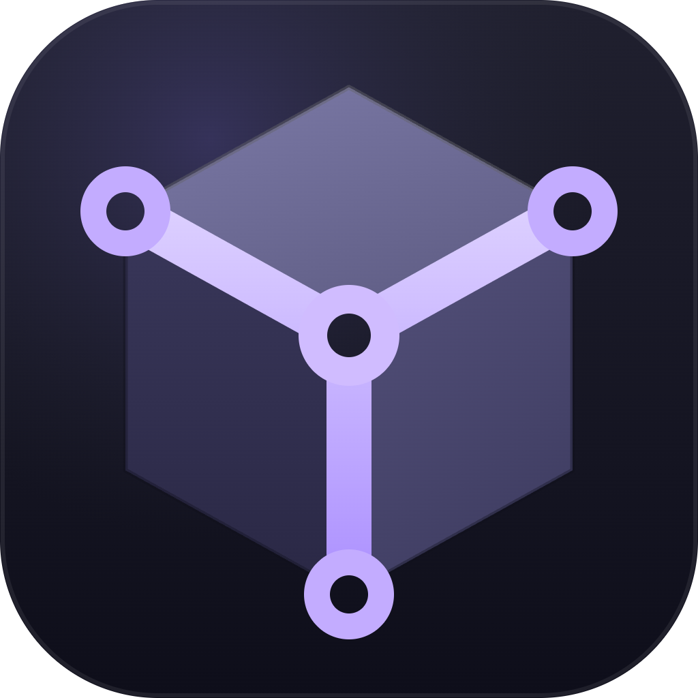
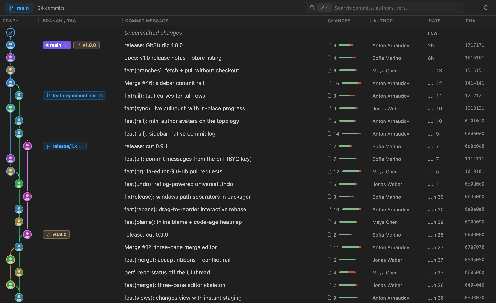
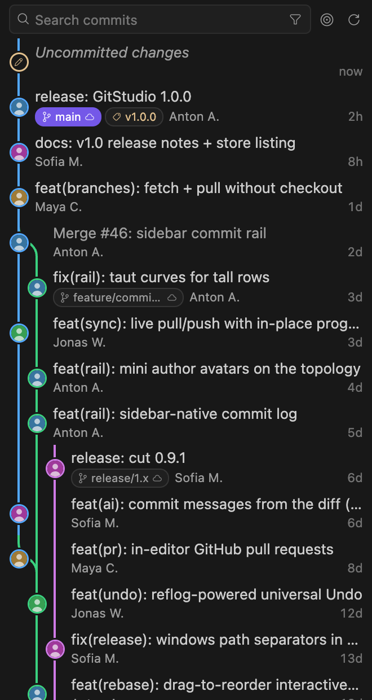
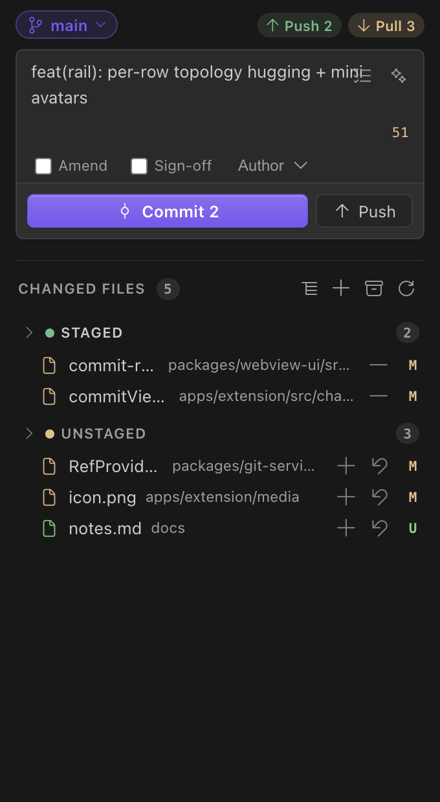
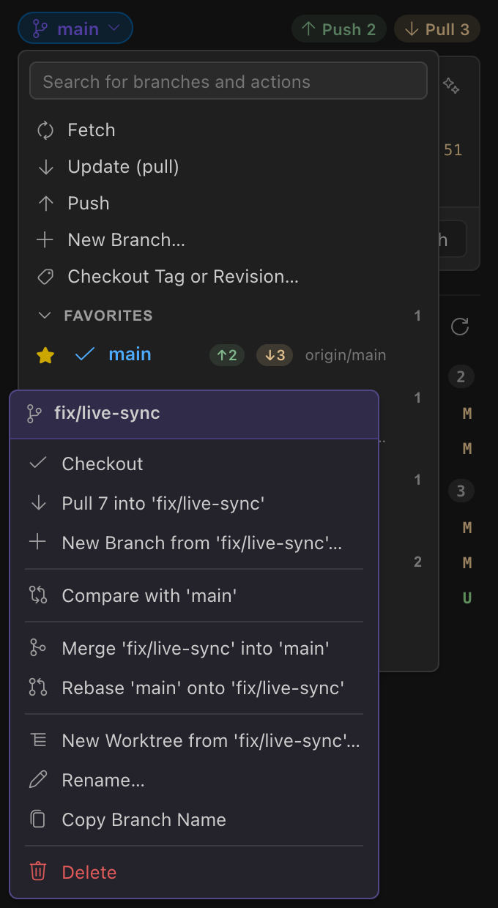

  

<h1 align="center">GitStudio</h1>

  <b>A free, open-source, JetBrains-style Git GUI for VS Code and Cursor — a full alternative to GitLens, GitKraken &amp; Sourcetree, in one extension.</b>

---

VS Code's built-in Git is functional but flat. GitLens is great at *information* — blame, history, lenses — but the *interaction* (merging, staging, rebasing, resolving) still sends you to the terminal or a separate app. GitStudio owns both: a live commit graph, inline blame, file and line history, hunk/line staging, a three-pane merge editor, drag-to-reorder interactive rebase with a universal Undo, first-class branches/stashes/worktrees/tags, in-editor GitHub pull-request review, and an optional bring-your-own-key AI layer. All of it free, on public and private repos, with no account and no paywall.

## The commit graph

**A real graph, not a log with lines drawn on it.** The full-screen Commit Graph panel renders colored branch lanes, ref chips, and author avatars on the commit nodes, and stays fast at tens of thousands of commits because rendering is virtualized — it draws what's on screen, streams the rest as you scroll. Checkout, cherry-pick, branch, tag, or reset from any commit; full keyboard navigation; theme-aware light, dark, and high-contrast palettes.

**The graph also lives in your sidebar.** The Commits view is a sidebar-native commit log built for that width, not a shrunken copy of the panel: compact two-line rows (message on top; refs, author, age below) show 3–4× more history at a glance, the true branch topology renders as a rail with mini author avatars on the nodes, and remote branches fold into their local chip. Search with scopes — message, author, SHA, refs — and match stepping sit in the header. Every commit action is on right-click, and double-click or `Enter` promotes any commit into the full Commit Graph for deep work.

## Changes: staging and sync without the wait

**Staging is instant.** Files move the moment you click — the git operation reconciles in the background. Stage, unstage, or discard by file, folder, or whole group; stage exactly the hunks or lines you mean from any editor or diff (`Ctrl/Cmd+Alt+G S` on a selection). The commit box auto-grows and handles Amend, Sign-off, author override, and Commit & Push.

**Sync is live, not a status readout.** The ahead/behind counts in the header are real Push and Pull buttons that run the operation with a spinner in place. Force-push defaults to the safer `--force-with-lease`.

**The branch dialog does the work in place.** Fetch runs without closing the menu — the item spins, then every branch row's ↑/↓ badges update so you can see exactly what's unpulled where. Local branches can be **pulled without checking them out** (fast-forward from upstream, straight from the branch's submenu), and each branch carries its full operation set: checkout, merge into current, rebase onto, rename, delete, push/publish, set upstream, new branch from here, create worktree, compare.

## Blame, file history, line history

**Authorship where you're reading.** Current-line blame renders inline at the end of the line and in the status bar; toggle full-file annotations (`Ctrl/Cmd+Alt+G B`) for a code-age heatmap — recent changes warm, old changes cool — with rich hovers that link to the commit.

**History at three depths.** Per-file history, **line history** (blame-over-time for the code under your cursor, `Ctrl/Cmd+Alt+G H`), and revision navigation that steps a file backward and forward through its versions. When something goes truly wrong, the **reflog time machine** (`GitStudio: Show Reflog`) shows every place HEAD has been, so lost commits are recoverable, not gone.

## Merge conflicts in three panes

**Yours, result, theirs — the JetBrains layout.** Conflicted files open in a three-pane merge editor with one-click accept ribbons per conflict, and conflicts auto-open as they appear during a merge, rebase, or cherry-pick (configurable via `gitstudio.merge.autoOpen`). No hand-editing `<<<<<<<` markers.

## Interactive rebase with a real Undo

**Rebase you can see.** `GitStudio: Start Interactive Rebase…` opens a drag-to-reorder editor — pick, reword, edit, squash, fixup, drop — instead of a todo file in a text buffer.

**Undo is universal.** GitStudio snapshots the reflog before every destructive operation, and `Ctrl/Cmd+Alt+G Z` reverses the last one — a bad rebase, a wrong reset, an accidental branch delete. History that's already pushed falls back to a safe Revert instead of rewriting shared commits. Undo never hijacks your editor's `Ctrl/Cmd+Z`.

## Branches, stashes, worktrees, tags, remotes

- **Stashes** get a first-class view: one-click **Stash Changes**, per-row Apply / Pop / Branch / Drop, plus a stash control in the Changes toolbar.
- **Worktrees** get their own view too: open, create, remove, lock/unlock, and prune — the sane way to review a PR without stashing your work.
- **Tags** support checkout, delete, and push; **remotes** support add, manage, and fetch — all reachable from the branch dialog, the graph, or the Command Palette.

## GitHub pull requests, in-editor

**Review where the code is.** Sign in once with VS Code's built-in GitHub account — no extra token — and the Pull Requests view lists open PRs for the current repo. Open the description panel, check the PR out, start a review, add inline comments on the diff, submit, and merge with your preferred method (merge, squash, or rebase — default configurable). Create new PRs from the editor too. Not a GitHub repo, or not signed in? The view shows a quiet connect prompt; nothing breaks.

## Branch compare

**A GitHub-style compare, locally, for any two refs.** `GitStudio: Compare Branches/Tags…` (or *Compare with Current* from any branch) opens a panel with ahead/behind counts, the exact commits between the two refs, and the changed files as native VS Code diffs. Answer "what would this merge actually bring in" before you merge it.

## Optional AI, on your terms

**Off until you turn it on, and it never gates a Git operation.** GitBrain adds four commands — **Generate Commit Message**, **Explain Diff**, **Summarize Changes**, and **Review Changes** (a structured code review of your working tree, with a customizable review prompt) — plus a ✨ button in the commit box that drafts a message from your staged diff.

Connect it however you already pay for AI:

- **Zero-key** — if you have GitHub Copilot (or Cursor's models), GitStudio uses the VS Code Language Model API directly. No API key, nothing to configure; `gitstudio.ai.provider` is `auto` by default.
- **Anthropic** — `GitStudio: Set Anthropic API Key…`. Model IDs for fast/mid/deep tiers are configurable.
- **OpenAI-compatible** — `GitStudio: Set OpenAI API Key…`, with a configurable base URL, so it also works against local OpenAI-compatible servers.
- **Local CLI agents** — point GitBrain at Claude Code, Codex, or Gemini CLI; it drives the CLI's existing login, no key at all.

Keys live in your OS keychain via VS Code SecretStorage and are never sent to a webview. Commit-message style is configurable (`conventional`, `concise`, or `descriptive`).

## Built for speed

**The sidebar paints before you can look at it.** GitStudio ships its own git engine: it discovers your repo itself (symlink-safe `git rev-parse`) and reads history, status, stashes, and worktrees directly, instead of blocking on the built-in Git extension's activation and scan. Views keep their context when you switch away, so coming back is instant rather than a rebuild. The commit list re-renders only when something actually changed, the graph loads a small first page and streams the rest, and staging updates the UI optimistically while git catches up. Large monorepos are the design target, not the failure case.

## Why GitStudio

An honest comparison:

- **vs GitLens** — GitLens pioneered blame-and-history in VS Code and remains excellent at it. But its Commit Graph, worktrees, and AI sit behind a paid plan, and it's an information layer more than an interaction one. GitStudio's entire feature set — graph, worktrees, merge, rebase, PR review, AI — is free on public *and* private repos, and it handles the doing, not just the showing.
- **vs Git Graph** — a well-liked graph, but a graph alone isn't a workflow. GitStudio pairs its graph (panel *and* sidebar) with staging, merge, rebase, undo, stashes, worktrees, and PRs in the same extension.
- **vs GitKraken Desktop** — a polished client, but a separate paid app outside your editor. GitStudio brings the same class of graph and workflow into VS Code and Cursor, where your code, terminal, and AI tooling already live.

No account. No usage tracking or analytics. No feature flags waiting for your credit card.

## Privacy

No accounts, no usage tracking, no analytics — GitStudio never reports what you *do*. The one thing it sends, during the beta, is **anonymous crash reports** when a command fails, so we can find and fix bugs without waiting for someone to file them. Each report is only the *shape* of a failure — an error type with a scrubbed message/stack, or the name of the git operation that failed — tagged with a random install id and your OS/editor version. Absolute paths, home directories, emails, remote URLs (host, org, and repo), tokens, and full commit SHAs are stripped before anything leaves your machine. Never your code, file names, commit messages, or branch names. Crash reporting honors VS Code's global `telemetry.telemetryLevel` (turn that off and GitStudio sends nothing), and you can opt out of just this with `gitstudio.errorReporting.enabled: false`.

## Getting started

1. Install **GitStudio** from the [VS Code Marketplace](https://marketplace.visualstudio.com/items?itemName=gitstudio.gitstudio) or [Open VSX](https://open-vsx.org/extension/gitstudio/gitstudio). It runs identically in **VS Code**, **Cursor**, and **VSCodium**.
2. Open a folder containing a Git repository.
3. Click the GitStudio icon in the Activity Bar. The sidebar reads top-to-bottom as a workflow: **Changes** (commit box + working tree) → **Commits** (the live graph) → **Stashes** → **Worktrees** → **Pull Requests**.
4. Run **GitStudio: Get Started** for a guided walkthrough.

## Keyboard shortcuts

Everything lives under one conflict-free chord — `Ctrl+Alt+G` (`Cmd+Alt+G` on macOS), then a letter:

| Action | Windows / Linux | macOS |
|---|---|---|
| Toggle file blame annotations | `Ctrl+Alt+G` `B` | `Cmd+Alt+G` `B` |
| Show line history | `Ctrl+Alt+G` `H` | `Cmd+Alt+G` `H` |
| Open changes vs HEAD | `Ctrl+Alt+G` `D` | `Cmd+Alt+G` `D` |
| Stage selected lines | `Ctrl+Alt+G` `S` | `Cmd+Alt+G` `S` |
| Unstage selected lines | `Ctrl+Alt+G` `U` | `Cmd+Alt+G` `U` |
| Undo last Git operation | `Ctrl+Alt+G` `Z` | `Cmd+Alt+G` `Z` |

In the commit box, `Enter` commits and `Shift+Enter` inserts a newline. All bindings are remappable in *Keyboard Shortcuts*.

## Settings highlights

| Setting | Default | What it does |
|---|---|---|
| `gitstudio.blame.inlineEnabled` | `true` | Inline current-line blame at the end of the line. |
| `gitstudio.blame.heatmap` | `true` | Code-age heatmap on full-file blame annotations. |
| `gitstudio.merge.autoOpen` | `true` | Auto-open conflicted files in the 3-pane merge editor. |
| `gitstudio.push.forceWithLease` | `true` | Use `--force-with-lease` when force-pushing. |
| `gitstudio.ai.provider` | `auto` | `auto` · `copilot` · `anthropic` · `openai` · `off`. |
| `gitstudio.ai.commitStyle` | `conventional` | `conventional` · `concise` · `descriptive`. |
| `gitstudio.pr.defaultMergeMethod` | `squash` | `merge` · `squash` · `rebase`. |
| `gitstudio.errorReporting.enabled` | `true` | Send anonymous, scrubbed crash reports when a command fails (honors VS Code's telemetry setting). |

## Requirements

- **`git`** available on your `PATH` (any recent version). GitStudio talks to git directly — no other extension required.
- **VS Code 1.74+**, or a current Cursor / VSCodium.
- **Optional:** a GitHub sign-in (VS Code's built-in auth) for the Pull Requests view, and an AI provider (Copilot, an API key, or a local CLI agent) for GitBrain. Everything else works fully offline.

## Free & open source

GitStudio is **Apache-2.0**, developed in the open at [github.com/GitStudioHQ/gitstudio](https://github.com/GitStudioHQ/gitstudio). Bug reports and feature requests: [issues](https://github.com/GitStudioHQ/gitstudio/issues). A desktop app built on the same engine ships from the same repo — see [gitstudio.dev](https://gitstudio.dev).

Portions of the shared engine and webview UI originate from Merge Studio (MIT) — see `NOTICE`.