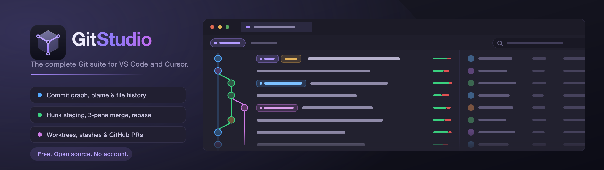
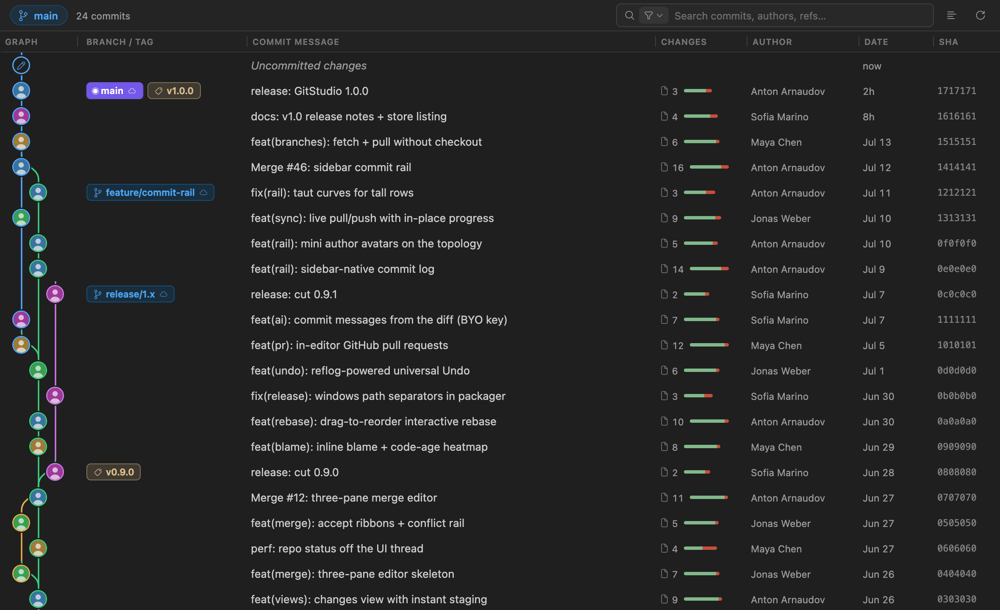
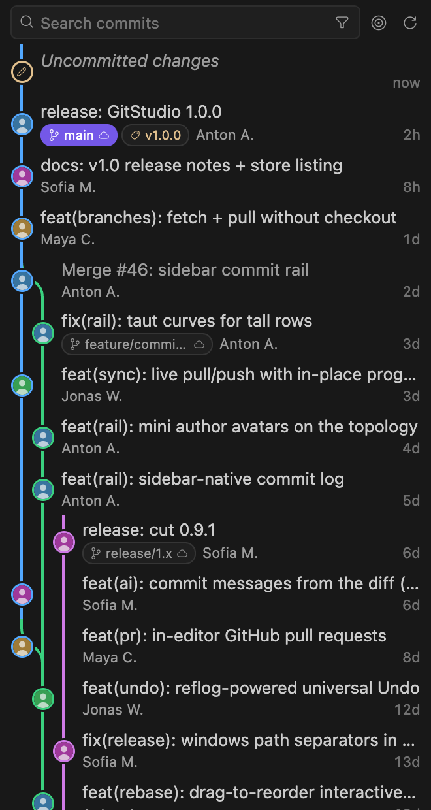
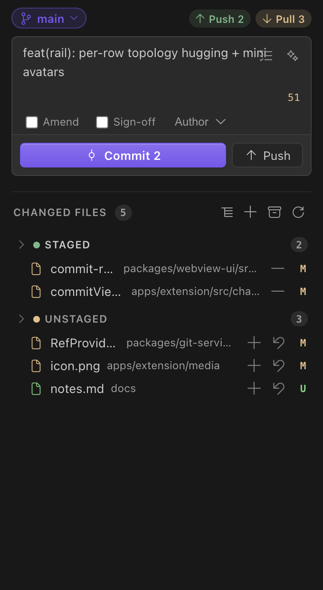
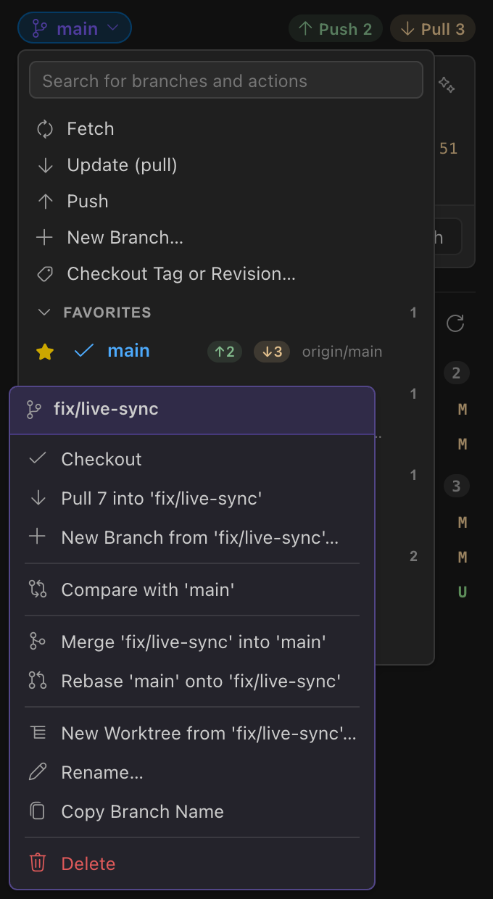

<h1 align="center">GitStudio</h1>

<p align="center">
  <b>The complete Git suite for VS Code and Cursor.</b><br>
  <b>A JetBrains-grade workflow, free on every repo.</b>
</p>

<p align="center">
  <a href="https://marketplace.visualstudio.com/items?itemName=gitstudio.gitstudio"></a>
  <a href="https://open-vsx.org/extension/gitstudio/gitstudio"></a>
  <a href="https://github.com/GitStudioHQ/gitstudio/actions/workflows/ci.yml"></a>
  <a href="https://github.com/GitStudioHQ/gitstudio/blob/main/LICENSE"></a>
  <a href="https://github.com/sponsors/antonarnaudov"></a>
  <a href="https://checkout.revolut.com/pay/7a6070ab-99ba-4170-a125-c5911b1a5c1d"></a>
</p>

<p align="center">
  
</p>

VS Code's built-in Git is functional but flat. GitLens is excellent at *information* — blame, history, lenses — but the *doing* (merging, staging, rebasing, resolving) still sends you to a terminal or a separate app. And the moment you want a commit graph or worktrees, you hit a paywall.

**GitStudio owns both halves, and charges for neither.** A real commit graph, inline blame, file and line history, hunk- and line-level staging, a three-pane merge editor, drag-to-reorder interactive rebase with a universal Undo, first-class branches, stashes, worktrees and tags, in-editor GitHub pull-request review, and an optional bring-your-own-key AI layer.

Free on public *and* private repos. No account, no sign-up, no analytics, no feature flags waiting on a credit card.

---

## What's inside

| | |
| --- | --- |
| **Visualize** | Full-screen commit graph *and* a sidebar-native commit rail · inline + full-file blame with a code-age heatmap · file & line history · revision navigation · reflog time machine |
| **Change** | Instant hunk- & line-level staging · guided commit box (amend, sign-off, author, Commit & Push) · side-by-side and unified diff · 3-pane merge editor that opens conflicts as they appear |
| **Rewrite** | Drag-to-reorder interactive rebase (pick · reword · edit · squash · fixup · drop) · a reflog-powered **Undo** for every destructive operation |
| **Manage** | Branches with live ↑/↓ badges, fetch-in-place and pull-without-checkout · remotes · tags · stashes · worktrees · GitHub-style branch compare |
| **Collaborate** | GitHub pull requests in the editor — list, check out, diff, comment inline, submit, merge, create |
| **Assist** | Optional AI: commit messages, explain-diff, summaries, code review. Bring your own key, use Copilot for free, or point it at a local model. Off by default. |

## The commit graph

**A real graph, not a log with lines drawn on it.** Colored branch lanes, ref chips, and author avatars riding the commit nodes. It stays fast at tens of thousands of commits because rendering is virtualized — it draws what's on screen and streams the rest as you scroll. Check out, cherry-pick, branch, tag, or reset from any commit, with full keyboard navigation and theme-aware light, dark, and high-contrast palettes.

<p align="center"></p>

**The graph also lives in your sidebar** — built for that width, not shrunk to fit. Compact two-line rows (message on top; refs, author, age below) show 3–4× more history at a glance, the true branch topology renders as a rail with mini author avatars, and remote branches fold into their local chip. Scoped search (message, author, SHA, refs) sits in the header. Every commit action is on right-click; double-click promotes a commit into the full graph for deep work.

<p align="center"></p>

## Staging and sync, without the wait

**Staging is instant.** Files move the moment you click — the git operation reconciles in the background. Stage, unstage, or discard by file, folder, or whole group, and stage exactly the hunks or lines you mean from any editor or diff (`Ctrl/Cmd+Alt+G S` on a selection).

**Sync is live, not a status readout.** The ahead/behind counts in the header *are* the Push and Pull buttons, and they run the operation with a spinner in place. Force-push defaults to the safer `--force-with-lease`.

**The branch dialog does the work without closing.** Fetch runs in place — the item spins, then every branch row's ↑/↓ badges update, so you can see exactly what's unpulled where. Local branches can be **pulled without checking them out**. Each branch carries its full operation set: checkout, merge, rebase onto, rename, delete, push/publish, set upstream, branch from here, create worktree, compare.

<table>
  <tr>
    <td width="50%"></td>
    <td width="50%"></td>
  </tr>
</table>

## Blame, file history, line history

**Authorship where you're reading.** Current-line blame renders inline at the end of the line and in the status bar. Toggle full-file annotations (`Ctrl/Cmd+Alt+G B`) for a code-age heatmap — recent changes warm, old changes cool — with rich hovers that link straight to the commit.

**History at three depths.** Per-file history, **line history** (blame-over-time for the code under your cursor, `Ctrl/Cmd+Alt+G H`), and revision navigation that steps a file backward and forward through its versions. When something goes truly wrong, **Show Reflog (Time Machine)** lists every place HEAD has been — so lost commits are recoverable, not gone.

## Merge, rebase, and a real Undo

**Yours, result, theirs — the JetBrains layout.** Conflicted files open in a three-pane merge editor with one-click accept ribbons per conflict, and conflicts auto-open as they appear during a merge, rebase, or cherry-pick. No hand-editing `<<<<<<<` markers.

**Rebase you can see.** *Start Interactive Rebase…* opens a drag-to-reorder workspace — pick, reword, edit, squash, fixup, drop — with a plain-English preview of what each action does, instead of a todo file in a text buffer.

**Undo is universal.** GitStudio snapshots the reflog before every destructive operation, and `Ctrl/Cmd+Alt+G Z` reverses the last one — a bad rebase, a wrong reset, an accidental branch delete. History that's already pushed falls back to a safe Revert rather than rewriting shared commits. Undo never hijacks your editor's `Ctrl/Cmd+Z`.

## Branches, stashes, worktrees, tags, remotes

- **Stashes** get a first-class view: one-click **Stash Changes**, per-row Apply / Pop / Branch / Drop, plus a stash control in the Changes toolbar.
- **Worktrees** get their own view: open, create, remove, lock/unlock, prune — the sane way to review a PR without stashing your work.
- **Tags** support checkout, delete, and push; **remotes** support add, manage, and fetch — all reachable from the branch dialog, the graph, or the Command Palette.

## GitHub pull requests, in-editor

**Review where the code is.** Sign in once with VS Code's built-in GitHub account — no extra token — and the Pull Requests view lists open PRs for the current repo. Open the description, check the PR out, start a review, comment inline on the diff, submit, and merge with your preferred method. Create new PRs from the editor too. Not a GitHub repo, or not signed in? The view shows a quiet connect prompt; nothing breaks.

## Branch compare

**A GitHub-style compare, locally, for any two refs.** *Compare Branches/Tags…* (or *Compare with Current* from any branch) opens a panel with ahead/behind counts, the exact commits between the two refs, and the changed files as native diffs. Answer "what would this merge actually bring in" *before* you merge it.

## Optional AI, on your terms

**Off until you turn it on, and it never gates a Git operation.** GitBrain adds **Generate Commit Message**, **Explain Diff**, **Summarize Changes**, and **Review Changes** — a structured review of your working tree with a customizable prompt — plus a ✨ button in the commit box that drafts a message from your staged diff.

Connect it however you already pay for AI:

- **Zero-key** — with GitHub Copilot (or Cursor's models), GitStudio uses the VS Code Language Model API directly. Nothing to configure.
- **Anthropic** or any **OpenAI-compatible** endpoint — bring a key, or point it at a local server (Ollama, LM Studio) with no key at all.
- **Local CLI agents** — drive Claude Code, Codex, or Gemini CLI through their existing login.

Keys are encrypted at rest in GitStudio's own private store and never reach a webview. GitStudio deliberately does **not** use your OS keychain, so it can never interrupt you with a system password prompt.

## Install

**VS Code** — search **GitStudio** in the Extensions view, or:

```bash
code --install-extension gitstudio.gitstudio
```

**Cursor / VSCodium / Windsurf / Gitpod** — via the [Open VSX Registry](https://open-vsx.org/extension/gitstudio/gitstudio):

```bash
cursor --install-extension gitstudio.gitstudio
```

…or replace `cursor` with `codium` / `windsurf`, or install from the Open VSX UI.

Then open a folder with a Git repo and click the GitStudio icon in the Activity Bar. The sidebar reads top-to-bottom as a workflow: **Changes** → **Commits** → **Stashes** → **Worktrees** → **Pull Requests**. Run **GitStudio: Get Started** for a guided tour.

> **Prefer a standalone app?** The same engine ships as a native desktop client for macOS, Windows, and Linux — with an integrated terminal, a GitHub home for your repo, and an AI assistant. Grab it from [gitstudio.dev](https://gitstudio.dev).

## Keyboard shortcuts

Everything lives under one conflict-free chord — `Ctrl+Alt+G` (`Cmd+Alt+G` on macOS), then a letter:

| Action | Windows / Linux | macOS |
| --- | --- | --- |
| Toggle file blame annotations | `Ctrl+Alt+G` `B` | `Cmd+Alt+G` `B` |
| Show line history | `Ctrl+Alt+G` `H` | `Cmd+Alt+G` `H` |
| Open changes vs HEAD | `Ctrl+Alt+G` `D` | `Cmd+Alt+G` `D` |
| Stage selected lines | `Ctrl+Alt+G` `S` | `Cmd+Alt+G` `S` |
| Unstage selected lines | `Ctrl+Alt+G` `U` | `Cmd+Alt+G` `U` |
| Undo last Git operation | `Ctrl+Alt+G` `Z` | `Cmd+Alt+G` `Z` |

In the commit box, `Enter` commits and `Shift+Enter` inserts a newline. All bindings are remappable in *Keyboard Shortcuts*.

## Settings

| Setting | Default | What it does |
| --- | --- | --- |
| `gitstudio.changes.autoRefresh` | `true` | Keep the Changes list current after a save, and on window focus |
| `gitstudio.blame.inlineEnabled` | `true` | Inline current-line blame at the end of the line |
| `gitstudio.blame.heatmap` | `true` | Code-age heatmap on full-file blame annotations |
| `gitstudio.merge.autoOpen` | `true` | Auto-open conflicted files in the 3-pane merge editor |
| `gitstudio.push.forceWithLease` | `true` | Use `--force-with-lease` when force-pushing |
| `gitstudio.ai.provider` | `auto` | `auto` · `copilot` · `anthropic` · `openai` · `off` |
| `gitstudio.ai.commitStyle` | `conventional` | `conventional` · `concise` · `descriptive` |
| `gitstudio.pr.defaultMergeMethod` | `squash` | `merge` · `squash` · `rebase` |
| `gitstudio.errorReporting.enabled` | `true` | Anonymous, scrubbed crash reports (honors VS Code's telemetry setting) |

## Requirements

**`git`** on your `PATH` (any recent version) — GitStudio talks to git directly, no other extension required — and **VS Code 1.74+**, Cursor, or VSCodium. A GitHub sign-in is optional (for pull requests), as is an AI provider. Everything else works fully offline.

## Why GitStudio

- **vs GitLens** — GitLens pioneered blame-and-history in VS Code and is still excellent at it. But its commit graph, worktrees, and AI sit behind a paid plan, and it's an information layer more than an interaction one. GitStudio's entire feature set is free on public *and* private repos, and it handles the doing, not just the showing.
- **vs Git Graph** — a well-liked graph, but a graph alone isn't a workflow. GitStudio pairs its graph (panel *and* sidebar) with staging, merge, rebase, undo, stashes, worktrees, and PRs in the same extension.
- **vs GitKraken Desktop** — a polished client, but a separate paid app outside your editor. GitStudio brings the same class of graph and workflow into VS Code and Cursor, where your code, terminal, and AI tooling already live.

## Privacy

No accounts, no usage tracking, no analytics — GitStudio never reports what you *do*. The one thing it sends, during the beta, is **anonymous crash reports** when a command fails, so bugs get found without waiting for someone to file them. Each report is only the *shape* of a failure — an error type with a scrubbed message, or the name of the git operation that failed — tagged with a random install id and your OS/editor version. Absolute paths, home directories, emails, remote URLs, tokens, and full commit SHAs are stripped before anything leaves your machine. Never your code, file names, commit messages, or branch names. It honors VS Code's global `telemetry.telemetryLevel`, and you can opt out of just this with `gitstudio.errorReporting.enabled: false`.

## Support

GitStudio is free, Apache-2.0, and built nights & weekends. If it earns a place in your workflow:

- ❤️ **[Sponsor on GitHub](https://github.com/sponsors/antonarnaudov)** — recurring support
- ☕ **[Buy me a coffee](https://checkout.revolut.com/pay/7a6070ab-99ba-4170-a125-c5911b1a5c1d)** — a one-off tip
- ⭐ **[Star the repo](https://github.com/GitStudioHQ/gitstudio)** or [rate it on the Marketplace](https://marketplace.visualstudio.com/items?itemName=gitstudio.gitstudio&ssr=false#review-details) — free, and it genuinely helps

Bugs and feature requests: [github.com/GitStudioHQ/gitstudio/issues](https://github.com/GitStudioHQ/gitstudio/issues).

## License

[Apache-2.0](https://github.com/GitStudioHQ/gitstudio/blob/main/LICENSE) — developed in the open at [GitStudioHQ/gitstudio](https://github.com/GitStudioHQ/gitstudio). Portions of the shared engine and webview UI originate from **Merge Studio** (MIT); see `NOTICE`.

---

<sub>JetBrains, IntelliJ IDEA, and WebStorm are trademarks of JetBrains s.r.o. GitLens, GitKraken, and Sourcetree are trademarks of their respective owners. GitStudio is an independent project and is not affiliated with, or endorsed by, any of them.</sub>
