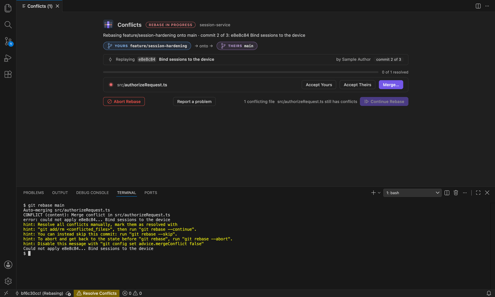
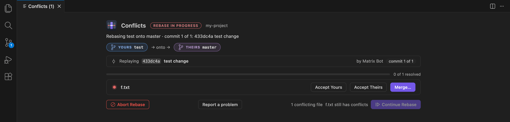
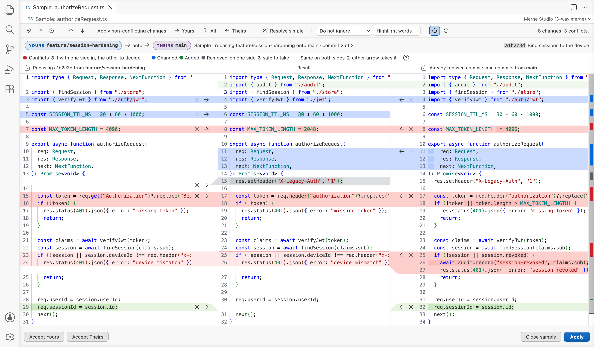
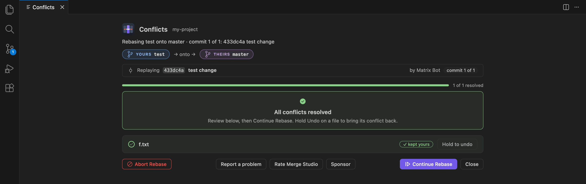
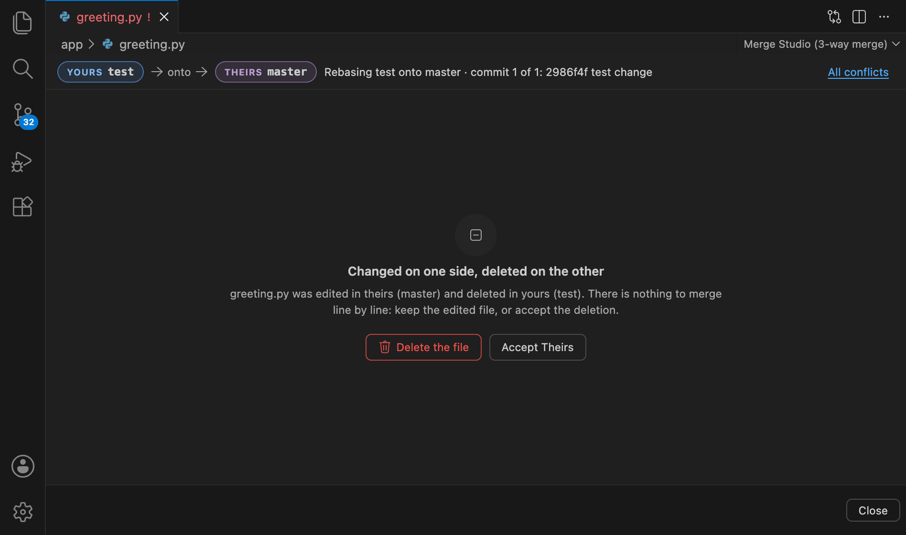
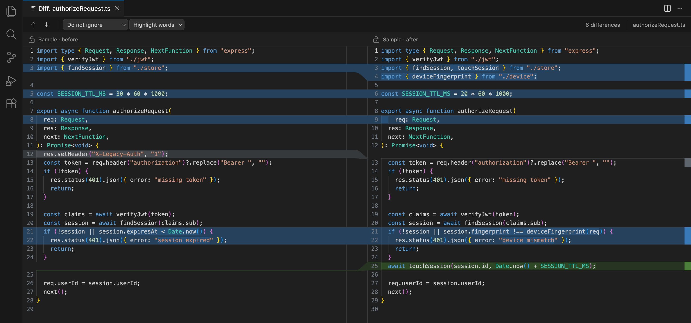

<h1 align="center">Merge Studio</h1>

<p align="center">
  <b>Resolve Git conflicts the JetBrains way, without leaving VS Code or Cursor.</b>
</p>

<p align="center">
  <a href="https://open-vsx.org/extension/gitstudio/merge-studio"></a>
  <a href="https://github.com/GitStudioHQ/merge-studio/actions/workflows/ci.yml"></a>
  <a href="NOTICE"></a>
</p>

<p align="center">
  
</p>

## Why Merge Studio

- **Yours, the result and theirs, side by side.** VS Code's built-in merge editor stacks Incoming and Current above the result. Merge Studio puts your side on the left, the file you will commit in the middle, and theirs on the right, joined by ribbons you click to take a change.
- **One dashboard for the whole merge or rebase.** Every conflicted file, what happened to it, and **Continue** and **Abort** for the operation itself (and **Skip**, where git offers it).
- **Every kind of change in its own colour**, with a legend, so a real conflict never hides among changes only one side made.
- **Undo for every pick.** Step back through a named history, or hold Undo on a resolved file to get its conflict back.

## Rebases: which side is yours?

During a rebase git swaps its own words: `--ours` is the branch you are rebasing onto, and `--theirs` is your commit. Merge Studio does not. **Yours** (left) is always your work, the commit being replayed, and **Theirs** (right) is the branch it is landing on. The header says which: *Rebasing test onto master · commit 1 of 3*.

<p align="center"></p>

## Every change, colour-coded

Each colour answers one question: does your choice matter here? They are
JetBrains' merge colours. The legend above the panes names each colour in
words, with how many changes are left.

<p align="center"></p>

| Colour | In the legend | Meaning |
| --- | --- | --- |
| orange | Conflict — you choose | Both sides changed the same lines, differently, and you decide what the result keeps. When the two edits touch but don't overlap, **Resolve simple** on the toolbar applies both. |
| green | Same on both sides — either arrow takes it | Both sides added or changed these lines the same way. There is nothing to choose: either arrow takes it, and it is settled on both sides at once. |
| blue | One side only — safe to take | Only one side added or changed these lines. |
| grey | Removed lines | Lines removed on one side only, or the same lines removed on both. No conflict: safe to take. |

As in JetBrains, a change still to decide wears its colour at two
strengths: its line numbers and its link across to the result in the full
colour, its lines in a lighter shade, and the words that changed in the full
colour again. A change that is all new, or all gone, is the full colour
throughout. A band that meets a line between two rows on the other side was
added there, or removed.

Once you settle a change it keeps a trace of what you took, in the lighter
shade of its colour: the side you took stays joined to the result, a side you
left out keeps only its outline, and when you took both, both stay joined to
it.

**Close** leaves the merge editor at any point without ending the merge or
rebase: the file keeps its conflict markers, and **Merge…** in the Conflicts
dashboard opens it again.

<p align="center"></p>

## The Conflicts dashboard

<p align="center"></p>

The dashboard opens the moment a merge, rebase, cherry-pick, revert, git am or stash pop stops on conflicts.

- Every conflicted file with **Accept Yours**, **Accept Theirs** and **Merge…**, and a badge for the tricky cases (deleted in theirs, added by both, …) named after the side, not git's stage number.
- A direction bar with both names (*test → onto → master*), the step (*commit 2 of 3*) and the commit being replayed.
- **Continue**, **Abort**, and **Skip** where git offers it (a cherry-pick, a revert, a patch). Abort and Skip ask first, in place, and say what they will do. Continue says why when it can't run yet, and asks before git drops a commit your resolution emptied.
- Resolved files stay in the list, labelled with how they were settled. **Hold Undo** on one to restore its original conflict.
- Binary files, and files deleted or added on one side, get a panel that says what happened and offers the choices that make sense: keep yours, keep theirs, or delete the file.

<p align="center"></p>

## Side-by-side diff

<p align="center"></p>

- **Compare in Merge Studio**: select two files in the Explorer, or compare one file with its last commit.
- **Open Changes in Merge Studio** from a changed file's title bar, and **Stage Changes with Ticks** to stage it one change at a time.
- The same ribbons and navigation as the merge editor, re-diffed live as you edit. With no decision to make, a diff colours a change by what it did: blue changed, green added, grey removed.

## Try it in 30 seconds

Run **Merge Studio: Open Sample Merge** from the Command Palette. A rebase stop opens in the three panes, *Sample: authorizeRequest.ts*: commit 2 of 3 of feature/session-hardening onto main, with every kind of change in it (conflicts, one of them the wand resolves; changes made the same on both sides; changes only in yours and only in theirs). Nothing in your repository is touched: Apply says what it would do in a real conflict, and Close closes the sample. **Merge Studio: Open Sample Diff** does the same for the diff, and **Merge Studio: Open Getting Started** walks through both.

## Keyboard

| Key | Does |
| --- | --- |
| F7 / Shift+F7 | Next / previous change |
| Cmd+Z / Shift+Cmd+Z (Ctrl on Windows and Linux) | Undo / redo a merge action |
| Enter or Space on a focused gutter button | Take that change (» or «), or ignore it (✕) |

## Settings

| Setting | Default | What it does |
| --- | --- | --- |
| `jbMerge.autoOpen` | `true` | Open conflicted files in Merge Studio and show the Conflicts dashboard when an operation stops. |
| `jbMerge.autoApplyNonConflicting` | `false` | When a file opens, apply every change only one side made, and every edit both sides made identically. Conflicts are never applied automatically. |
| `jbMerge.conflictResolver` | `embedded` | Where conflicted files open: `embedded` (Merge Studio) or `jetbrains` (an installed JetBrains IDE). |
| `jbMerge.diffTool` | `embedded` | Which diff Compare and Open Changes use: `embedded` or `jetbrains`. |
| `jbMerge.preferredIde` | `auto` | Which installed JetBrains IDE to hand merges and diffs to. |
| `jbMerge.jetbrainsPath` | `""` | A JetBrains IDE launcher to use instead of detection. User settings only. |

## Using GitStudio too?

[GitStudio](https://marketplace.visualstudio.com/items?itemName=gitstudio.gitstudio), the full Git GUI for VS Code and Cursor, ships this same merge editor and Conflicts dashboard. With both installed, GitStudio opens conflicts automatically and Merge Studio stays quiet, and says so the first time. Its commands (Resolve Conflicts…, Open Sample Merge, Compare) still work and open the same screens. To let Merge Studio do it instead, set `gitstudio.merge.autoOpen` to `false`. An older GitStudio without the Conflicts dashboard changes nothing: Merge Studio keeps opening conflicts itself.

Want only a merge tool? Use Merge Studio. Want the commit graph, blame, staging and interactive rebase too? Use GitStudio.

## Open in a JetBrains IDE

Prefer to resolve in a JetBrains IDE? Set `jbMerge.conflictResolver` to `jetbrains` (or `jbMerge.diffTool` for diffs) and Merge Studio hands the file to your installed IntelliJ IDEA, WebStorm, PyCharm, PhpStorm, GoLand, CLion, Rider, RubyMine or DataGrip, with your side as the IDE's left side. IDEs in the usual install folders on macOS, Windows and Linux are found automatically, including JetBrains Toolbox installs. Anywhere else, put the IDE's launcher on your `PATH` or set `jbMerge.jetbrainsPath`.

## Install

**VS Code**: search **Merge Studio** in the Extensions view, or:

```bash
code --install-extension gitstudio.merge-studio
```

**Cursor, VSCodium, Windsurf, Gitpod**: from the [Open VSX Registry](https://open-vsx.org/extension/gitstudio/merge-studio):

```bash
cursor --install-extension gitstudio.merge-studio
```

Requires VS Code 1.82 (August 2023) or newer, **git**, and VS Code's built-in Git extension turned on. Cursor, Windsurf and VSCodium already meet this.

## FAQ

**Which side is mine in a rebase?** Yours, on the left: the commit being replayed from your branch. See [Rebases: which side is yours?](#rebases-which-side-is-yours)

**VS Code's own merge editor still opens.** At your first conflict Merge Studio offers to turn off VS Code's merge editor and its conflict highlights (once: if an earlier Merge Studio already asked you, it doesn't ask again). You can do it later from **Settings** (`git.mergeEditor`, `merge-conflict.codeLens.enabled`, `merge-conflict.decorators.enabled`), and put them back with **Merge Studio: Restore VS Code's Merge Editor**.

**How do I stop files opening by themselves?** Set `jbMerge.autoOpen` to `false`. **Merge Studio: Resolve Conflicts…** still opens the dashboard when you want it.

**What about binary or deleted files?** They open a panel instead of a text merge: keep yours, keep theirs, or delete the file.

**Does it work in a git worktree?** Yes. Merge Studio watches the worktree's own git directory.

## Known limitations

- Merge Studio needs a local repository on disk; virtual workspaces are not supported.
- Merge Studio is off in Restricted Mode: it works through VS Code's built-in Git extension, which Restricted Mode turns off. Trust the folder to use it.
- One Conflicts dashboard at a time: with conflicts in two repositories, it shows the active one.

## Feedback and support

Found a bug, or a merge that went wrong? [Open an issue](https://github.com/GitStudioHQ/merge-studio/issues). The dashboard's **Report a problem** link fills in your Merge Studio and editor versions for you.

Merge Studio is free. If it saves you a bad merge:

- [Sponsor on GitHub](https://github.com/sponsors/antonarnaudov): recurring support
- [Buy me a coffee](https://checkout.revolut.com/pay/7a6070ab-99ba-4170-a125-c5911b1a5c1d): a one-off tip

## License

Merge Studio's own files are [MIT](LICENSE). It bundles GitStudio's shared merge packages, which are [Apache-2.0](LICENSE-APACHE); see [NOTICE](NOTICE). The source is developed in [GitStudioHQ/gitstudio](https://github.com/GitStudioHQ/gitstudio) (`apps/merge-studio`, with the shared `packages/*`); see [CONTRIBUTING.md](CONTRIBUTING.md).

---

<sub>JetBrains, IntelliJ IDEA, WebStorm, PyCharm, PhpStorm, GoLand, CLion, Rider, RubyMine and DataGrip are trademarks of JetBrains s.r.o. Merge Studio is an independent project and is not affiliated with, or endorsed by, JetBrains.</sub>
